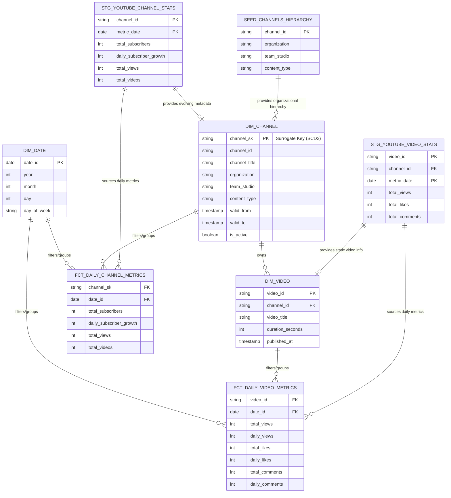

# Logical Data Model: YouTube Metrics Pipeline

## 1. Entity Relationship Diagram (ERD)

The following diagram illustrates the relationship between the static hierarchy config (seed), the intermediate staging layer, and the final dimensional Mart models (Star Schema).

## 2. Table Definitions & Grain (Mart Layer)

For the final presentation layer, we strictly follow Kimball principles. 

### Dimensions

*   **`dim_channel`**
    *   **Primary Key:** `channel_sk` (Surrogate Key generated by dbt Snapshot, typically a hash of `channel_id` + `updated_at`).
    *   **Natural Key:** `channel_id`
    *   **Grain:** One row per channel, per valid time period. As an SCD Type 2 dimension, a channel will have multiple records if metadata (like its name or hierarchy) changes over time.

*   **`dim_video`**
    *   **Primary Key:** `video_id`
    *   **Natural Key:** `video_id`
    *   **Grain:** One row per unique video. Contains static descriptors that do not change after publishing (duration, title, publish timestamp).

*   **`dim_date`**
    *   **Primary Key:** `date_id` (Date formatted as `YYYY-MM-DD`).
    *   **Grain:** One row per calendar day. Used as the unified time axis for all reporting.

### Facts

*   **`fct_daily_channel_metrics`**
    *   **Primary Key:** Composite of `channel_sk` + `date_id` (or `channel_id` + `date_id`).
    *   **Grain:** One row per active channel, per day. Captures both cumulative metrics (e.g., total subscribers) and discrete deltas (e.g., net new subscribers for that day).

*   **`fct_daily_video_metrics`**
    *   **Primary Key:** Composite of `video_id` + `date_id`.
    *   **Grain:** One row per video, per day. Captures performance deltas (views, likes, comments gained on that specific day) as well as the running total at the end of the day.

## 3. Source-to-Target Mapping

This mapping traces the nested JSON fields from the raw YouTube Channel API response down to their final destination in the dimensional layer.

| Source JSON Path (API Response) | Intermediate Stage | Final Mart Destination | Target Column Name | Notes |
| :--- | :--- | :--- | :--- | :--- |
| `items[].id` | `landing.raw_json` -> `stg_youtube_channel_stats` | `dim_channel` / Facts | `channel_id` | Used as the natural grain across models |
| `items[].snippet.title` | `landing.raw_json` -> `stg_youtube_channel_stats` | `dim_channel` | `channel_title` | SCD2 tracked for renames |
| `items[].snippet.customUrl` | `landing.raw_json` -> `stg_youtube_channel_stats` | `dim_channel` | `channel_custom_url` | SCD2 tracked |
| `items[].snippet.publishedAt` | `landing.raw_json` -> `stg_youtube_channel_stats` | `dim_channel` | `channel_published_at` | Static metadata |
| `items[].snippet.country` | `landing.raw_json` -> `stg_youtube_channel_stats` | `dim_channel` | `channel_country` | SCD2 tracked |
| `items[].statistics.subscriberCount` | `landing.raw_json` -> `stg_youtube_channel_stats` | `fct_daily_channel_metrics`| `total_subscribers` | Cumulative total at extraction time |
| *Calculated in Staging* | `stg_youtube_channel_stats` | `fct_daily_channel_metrics`| `daily_subscriber_growth` | `total_subscribers` today - `total_subscribers` yesterday |
| `items[].statistics.viewCount` | `landing.raw_json` -> `stg_youtube_channel_stats` | `fct_daily_channel_metrics`| `total_views` | Cumulative channel views |
| `items[].statistics.videoCount` | `landing.raw_json` -> `stg_youtube_channel_stats` | `fct_daily_channel_metrics`| `total_videos` | Cumulative video count |
| *Hierarchy Seed File (CSV)* | `seed_channels_hierarchy` | `dim_channel` | `organization`, `team_studio`, `content_type` | Merged via static mapping |
| `items[].id` (Video API) | `landing.raw_json` -> `stg_youtube_video_stats` | `dim_video` / Facts | `video_id` | Used as the natural grain for videos |
| `items[].snippet.channelId` | `landing.raw_json` -> `stg_youtube_video_stats` | `dim_video` / Facts | `channel_id` | Foreign key mapping to channel |
| `items[].snippet.title` | `landing.raw_json` -> `stg_youtube_video_stats` | `dim_video` | `video_title` | Static metadata |
| `items[].contentDetails.duration`| `landing.raw_json` -> `stg_youtube_video_stats` | `dim_video` | `duration_seconds` | Requires ISO 8601 parsing in staging |
| `items[].snippet.publishedAt` | `landing.raw_json` -> `stg_youtube_video_stats` | `dim_video` | `published_at` | Static metadata |
| `items[].statistics.viewCount` | `landing.raw_json` -> `stg_youtube_video_stats` | `fct_daily_video_metrics`| `total_views` | Cumulative video views |
| `items[].statistics.likeCount` | `landing.raw_json` -> `stg_youtube_video_stats` | `fct_daily_video_metrics`| `total_likes` | Cumulative video likes |
| `items[].statistics.commentCount`| `landing.raw_json` -> `stg_youtube_video_stats` | `fct_daily_video_metrics`| `total_comments` | Cumulative video comments |
| *Calculated in Staging* | `stg_youtube_video_stats` | `fct_daily_video_metrics`| `daily_views` | `total_views` today - yesterday |
| *Calculated in Staging* | `stg_youtube_video_stats` | `fct_daily_video_metrics`| `daily_likes` | `total_likes` today - yesterday |
| *Calculated in Staging* | `stg_youtube_video_stats` | `fct_daily_video_metrics`| `daily_comments` | `total_comments` today - yesterday |
