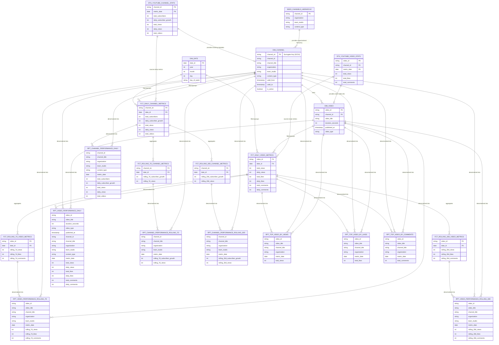

# Logical Data Model: YouTube Metrics Pipeline

## 1. Entity Relationship Diagram (ERD)

The following diagram illustrates the relationship between the static hierarchy config (seed), the intermediate staging layer, and the final dimensional Mart models (Star Schema).

```mermaid
erDiagram
    %% Static Configuration
    SEED_CHANNELS_HIERARCHY {
        string channel_id PK
        string organization
        string team_studio
        string content_type
    }

    %% Staging Layer
    STG_YOUTUBE_CHANNEL_STATS {
        string channel_id PK
        date metric_date PK
        int total_subscribers
        int daily_subscriber_growth
        int total_views
        int daily_views
        int total_videos
    }
    
    STG_YOUTUBE_VIDEO_STATS {
        string video_id PK
        string channel_id FK
        date metric_date PK
        int total_views
        int total_likes
        int total_comments
    }

    %% Mart Layer: Dimensions
    DIM_CHANNEL {
        string channel_sk PK "Surrogate Key (SCD2)"
        string channel_id
        string channel_title
        string organization
        string team_studio
        string content_type
        timestamp valid_from
        timestamp valid_to
        boolean is_active
    }

    DIM_VIDEO {
        string video_id PK
        string channel_id FK
        string video_title
        int duration_seconds
        timestamp published_at
        string video_type
    }

    DIM_DATE {
        date date_id PK
        int year
        int month
        int day
        string day_of_week
    }

    %% Mart Layer: Facts
    FCT_DAILY_CHANNEL_METRICS {
        string channel_sk FK
        date date_id FK
        int total_subscribers
        int daily_subscriber_growth
        int total_views
        int daily_views
        int total_videos
    }

    FCT_DAILY_VIDEO_METRICS {
        string video_id FK
        date date_id FK
        int total_views
        int daily_views
        int total_likes
        int daily_likes
        int total_comments
        int daily_comments
    }
    
    FCT_ROLLING_7D_CHANNEL_METRICS {
        string channel_sk FK
        date date_id FK
        int rolling_7d_subscriber_growth
        int rolling_7d_views
    }

    FCT_ROLLING_7D_VIDEO_METRICS {
        string video_id FK
        date date_id FK
        int rolling_7d_views
        int rolling_7d_likes
        int rolling_7d_comments
    }

    FCT_ROLLING_30D_CHANNEL_METRICS {
        string channel_sk FK
        date date_id FK
        int rolling_30d_subscriber_growth
        int rolling_30d_views
    }

    FCT_ROLLING_30D_VIDEO_METRICS {
        string video_id FK
        date date_id FK
        int rolling_30d_views
        int rolling_30d_likes
        int rolling_30d_comments
    }

    %% Presentation Layer (OBT Views for Streamlit)
    RPT_VIDEO_PERFORMANCE_DAILY {
        string video_id
        string video_title
        int duration_seconds
        string video_type
        timestamp published_at
        string channel_id
        string channel_title
        string organization
        string team_studio
        string content_type
        date metric_date
        int total_views
        int daily_views
        int total_likes
        int daily_likes
        int total_comments
        int daily_comments
    }

    RPT_CHANNEL_PERFORMANCE_DAILY {
        string channel_id
        string channel_title
        string organization
        string team_studio
        string content_type
        date metric_date
        int total_subscribers
        int daily_subscriber_growth
        int total_views
        int daily_views
        int total_videos
    }

    RPT_VIDEO_PERFORMANCE_ROLLING_7D {
        string video_id
        string video_title
        string channel_title
        string organization
        string team_studio
        date metric_date
        int rolling_7d_views
        int rolling_7d_likes
        int rolling_7d_comments
    }

    RPT_CHANNEL_PERFORMANCE_ROLLING_7D {
        string channel_id
        string channel_title
        string organization
        string team_studio
        date metric_date
        int rolling_7d_subscriber_growth
        int rolling_7d_views
    }

    RPT_VIDEO_PERFORMANCE_ROLLING_30D {
        string video_id
        string video_title
        string channel_title
        string organization
        string team_studio
        date metric_date
        int rolling_30d_views
        int rolling_30d_likes
        int rolling_30d_comments
    }

    RPT_CHANNEL_PERFORMANCE_ROLLING_30D {
        string channel_id
        string channel_title
        string organization
        string team_studio
        date metric_date
        int rolling_30d_subscriber_growth
        int rolling_30d_views
    }

    RPT_TOP_VIDEO_BY_VIEWS {
        string video_id
        string video_title
        string channel_title
        string organization
        date metric_date
        int total_views
    }

    RPT_TOP_VIDEO_BY_LIKES {
        string video_id
        string video_title
        string channel_title
        string organization
        date metric_date
        int total_likes
    }

    RPT_TOP_VIDEO_BY_COMMENTS {
        string video_id
        string video_title
        string channel_title
        string organization
        date metric_date
        int total_comments
    }

    %% Relationships
    SEED_CHANNELS_HIERARCHY ||--o{ DIM_CHANNEL : "provides organizational hierarchy"
    STG_YOUTUBE_CHANNEL_STATS ||--o| DIM_CHANNEL : "provides evolving metadata"
    STG_YOUTUBE_CHANNEL_STATS ||--o{ FCT_DAILY_CHANNEL_METRICS : "sources daily metrics"
    STG_YOUTUBE_VIDEO_STATS ||--o| DIM_VIDEO : "provides static video info"
    STG_YOUTUBE_VIDEO_STATS ||--o{ FCT_DAILY_VIDEO_METRICS : "sources daily metrics"
    
    DIM_CHANNEL ||--o{ FCT_DAILY_CHANNEL_METRICS : "filters/groups"
    DIM_DATE ||--o{ FCT_DAILY_CHANNEL_METRICS : "filters/groups"
    DIM_CHANNEL ||--o{ DIM_VIDEO : "owns"
    DIM_VIDEO ||--o{ FCT_DAILY_VIDEO_METRICS : "filters/groups"
    DIM_DATE ||--o{ FCT_DAILY_VIDEO_METRICS : "filters/groups"
    
    FCT_DAILY_CHANNEL_METRICS ||--o{ FCT_ROLLING_7D_CHANNEL_METRICS : "aggregates"
    FCT_DAILY_VIDEO_METRICS ||--o{ FCT_ROLLING_7D_VIDEO_METRICS : "aggregates"
    FCT_DAILY_CHANNEL_METRICS ||--o{ FCT_ROLLING_30D_CHANNEL_METRICS : "aggregates"
    FCT_DAILY_VIDEO_METRICS ||--o{ FCT_ROLLING_30D_VIDEO_METRICS : "aggregates"

    DIM_VIDEO ||--o{ RPT_VIDEO_PERFORMANCE_DAILY : "denormalized into"
    DIM_CHANNEL ||--o{ RPT_VIDEO_PERFORMANCE_DAILY : "denormalized into"
    FCT_DAILY_VIDEO_METRICS ||--o{ RPT_VIDEO_PERFORMANCE_DAILY : "denormalized into"

    DIM_CHANNEL ||--o{ RPT_CHANNEL_PERFORMANCE_DAILY : "denormalized into"
    FCT_DAILY_CHANNEL_METRICS ||--o{ RPT_CHANNEL_PERFORMANCE_DAILY : "denormalized into"

    DIM_VIDEO ||--o{ RPT_VIDEO_PERFORMANCE_ROLLING_7D : "denormalized into"
    DIM_CHANNEL ||--o{ RPT_VIDEO_PERFORMANCE_ROLLING_7D : "denormalized into"
    FCT_ROLLING_7D_VIDEO_METRICS ||--o{ RPT_VIDEO_PERFORMANCE_ROLLING_7D : "denormalized into"

    DIM_CHANNEL ||--o{ RPT_CHANNEL_PERFORMANCE_ROLLING_7D : "denormalized into"
    FCT_ROLLING_7D_CHANNEL_METRICS ||--o{ RPT_CHANNEL_PERFORMANCE_ROLLING_7D : "denormalized into"

    DIM_VIDEO ||--o{ RPT_VIDEO_PERFORMANCE_ROLLING_30D : "denormalized into"
    DIM_CHANNEL ||--o{ RPT_VIDEO_PERFORMANCE_ROLLING_30D : "denormalized into"
    FCT_ROLLING_30D_VIDEO_METRICS ||--o{ RPT_VIDEO_PERFORMANCE_ROLLING_30D : "denormalized into"

    DIM_CHANNEL ||--o{ RPT_CHANNEL_PERFORMANCE_ROLLING_30D : "denormalized into"
    FCT_ROLLING_30D_CHANNEL_METRICS ||--o{ RPT_CHANNEL_PERFORMANCE_ROLLING_30D : "denormalized into"

    DIM_VIDEO ||--o{ RPT_TOP_VIDEO_BY_VIEWS : "denormalized into"
    DIM_CHANNEL ||--o{ RPT_TOP_VIDEO_BY_VIEWS : "denormalized into"
    FCT_DAILY_VIDEO_METRICS ||--o{ RPT_TOP_VIDEO_BY_VIEWS : "denormalized into"

    DIM_VIDEO ||--o{ RPT_TOP_VIDEO_BY_LIKES : "denormalized into"
    DIM_CHANNEL ||--o{ RPT_TOP_VIDEO_BY_LIKES : "denormalized into"
    FCT_DAILY_VIDEO_METRICS ||--o{ RPT_TOP_VIDEO_BY_LIKES : "denormalized into"

    DIM_VIDEO ||--o{ RPT_TOP_VIDEO_BY_COMMENTS : "denormalized into"
    DIM_CHANNEL ||--o{ RPT_TOP_VIDEO_BY_COMMENTS : "denormalized into"
    FCT_DAILY_VIDEO_METRICS ||--o{ RPT_TOP_VIDEO_BY_COMMENTS : "denormalized into"
```

## 2. Table Definitions & Grain (Mart Layer)

For the final presentation layer, we strictly follow Kimball principles. 

### Dimensions

*   **`dim_channel`**
    *   **Primary Key:** `channel_sk` (Surrogate Key generated by dbt Snapshot, typically a hash of `channel_id` + `updated_at`).
    *   **Natural Key:** `channel_id`
    *   **Grain:** One row per channel, per valid time period. As an SCD Type 2 dimension, a channel will have multiple records if metadata (like its name or hierarchy) changes over time.

*   **`dim_video`**
    *   **Primary Key:** `video_id`
    *   **Natural Key:** `video_id`
    *   **Grain:** One row per unique video. Contains static descriptors that do not change after publishing (duration, title, publish timestamp, video type classification).

*   **`dim_date`**
    *   **Primary Key:** `date_id` (Date formatted as `YYYY-MM-DD`).
    *   **Grain:** One row per calendar day. Used as the unified time axis for all reporting.

### Facts

*   **`fct_daily_channel_metrics`**
    *   **Primary Key:** Composite of `channel_sk` + `date_id` (or `channel_id` + `date_id`).
    *   **Grain:** One row per active channel, per day. Captures both cumulative metrics (e.g., total subscribers), discrete deltas (e.g., net new subscribers for that day), and daily view counts.

*   **`fct_daily_video_metrics`**
    *   **Primary Key:** Composite of `video_id` + `date_id`.
    *   **Grain:** One row per video, per day. Captures performance deltas (views, likes, comments gained on that specific day) as well as the running total at the end of the day.

*   **`fct_rolling_7d_channel_metrics`**
    *   **Primary Key:** Composite of `channel_sk` + `date_id` (or `channel_id` + `date_id`).
    *   **Grain:** One row per active channel, per day. Stores the trailing 7-day aggregated metrics (e.g., rolling sum of subscriber growth and views).

*   **`fct_rolling_7d_video_metrics`**
    *   **Primary Key:** Composite of `video_id` + `date_id`.
    *   **Grain:** One row per video, per day. Stores the trailing 7-day aggregated metrics (e.g., rolling sum of views, likes, comments).

*   **`fct_rolling_30d_channel_metrics`**
    *   **Primary Key:** Composite of `channel_sk` + `date_id` (or `channel_id` + `date_id`).
    *   **Grain:** One row per active channel, per day. Stores the trailing 30-day aggregated metrics (e.g., rolling sum of subscriber growth and views).

*   **`fct_rolling_30d_video_metrics`**
    *   **Primary Key:** Composite of `video_id` + `date_id`.
    *   **Grain:** One row per video, per day. Stores the trailing 30-day aggregated metrics (e.g., rolling sum of views, likes, comments).

### Reporting / Presentation Layer (OBT Views)

To simplify downstream analytical consumption and ensure optimal performance for Streamlit applications, we deploy denormalized reporting views (One Big Table format).

*   **Constraint Rule:** All presentation layer views must strictly enforce an upper-bound filter of `metric_date <= DATEADD(day, -1, CURRENT_DATE())` to guarantee they only expose historical daily data up to "yesterday". This prevents manual intra-day pipeline runs from leaking incomplete "today" data into the dashboards, which would misalign the rolling windows and leaderboard `MAX(date_id)` calculations.

*   **`rpt_video_performance_daily`**
    *   **Grain:** One row per video, per day.
    *   **Description:** Fully denormalized view combining `fct_daily_video_metrics` with `dim_video` and `dim_channel` details. Pre-computes video descriptors, creator hierarchy, and daily/cumulative engagement metrics, eliminating query-time joins in downstream applications.
    *   **Core Attributes:** `video_title`, `video_type`, `channel_title`, `organization`, `team_studio`, `metric_date`, `total_views`, `daily_views`, `total_likes`, `daily_likes`.

*   **`rpt_channel_performance_daily`**
    *   **Grain:** One row per channel, per day.
    *   **Description:** Fully denormalized view combining `fct_daily_channel_metrics` with `dim_channel` metadata.
    *   **Core Attributes:** `channel_title`, `organization`, `team_studio`, `content_type`, `metric_date`, `total_subscribers`, `daily_subscriber_growth`, `total_views`, `daily_views`.

*   **`rpt_video_performance_rolling_7d`**
    *   **Grain:** One row per video, per day.
    *   **Description:** Fully denormalized view for rolling 7-day video metrics.

*   **`rpt_channel_performance_rolling_7d`**
    *   **Grain:** One row per channel, per day.
    *   **Description:** Fully denormalized view for rolling 7-day channel metrics.

*   **`rpt_video_performance_rolling_30d`**
    *   **Grain:** One row per video, per day.
    *   **Description:** Fully denormalized view for rolling 30-day video metrics.

*   **`rpt_channel_performance_rolling_30d`**
    *   **Grain:** One row per channel, per day.
    *   **Description:** Fully denormalized view for rolling 30-day channel metrics.

*   **`rpt_top_video_by_views`**
    *   **Grain:** Top 50 global videos, by views.
    *   **Description:** Fully denormalized view pre-calculating and sorting the top performing videos up to the current date by total views.

*   **`rpt_top_video_by_likes`**
    *   **Grain:** Top 50 global videos, by likes.
    *   **Description:** Fully denormalized view pre-calculating and sorting the top performing videos up to the current date by total likes.

*   **`rpt_top_video_by_comments`**
    *   **Grain:** Top 50 global videos, by comments.
    *   **Description:** Fully denormalized view pre-calculating and sorting the top performing videos up to the current date by total comments.

## 3. Source-to-Target Mapping

This mapping traces the nested JSON fields from the raw YouTube Channel API response down to their final destination in the dimensional layer.

| Source JSON Path (API Response) | Intermediate Stage | Final Mart Destination | Target Column Name | Notes |
| :--- | :--- | :--- | :--- | :--- |
| `items[].id` | `landing` -> `raw` -> `stg_youtube_channel_stats` | `dim_channel` / Facts | `channel_id` | Used as the natural grain across models |
| `items[].snippet.title` | `landing` -> `raw` -> `stg_youtube_channel_stats` | `dim_channel` | `channel_title` | SCD2 tracked for renames |
| `items[].snippet.customUrl` | `landing` -> `raw` -> `stg_youtube_channel_stats` | `dim_channel` | `channel_custom_url` | SCD2 tracked |
| `items[].snippet.publishedAt` | `landing` -> `raw` -> `stg_youtube_channel_stats` | `dim_channel` | `channel_published_at` | Static metadata |
| `items[].snippet.country` | `landing` -> `raw` -> `stg_youtube_channel_stats` | `dim_channel` | `channel_country` | SCD2 tracked |
| `items[].statistics.subscriberCount` | `landing` -> `raw` -> `stg_youtube_channel_stats` | `fct_daily_channel_metrics`| `total_subscribers` | Cumulative total at extraction time |
| *Calculated in Staging* | `stg_youtube_channel_stats` | `fct_daily_channel_metrics`| `daily_subscriber_growth` | `total_subscribers` today - `total_subscribers` yesterday |
| `items[].statistics.viewCount` | `landing` -> `raw` -> `stg_youtube_channel_stats` | `fct_daily_channel_metrics`| `total_views` | Cumulative channel views |
| *Calculated in Staging* | `stg_youtube_channel_stats` | `fct_daily_channel_metrics`| `daily_views` | `total_views` today - `total_views` yesterday |
| `items[].statistics.videoCount` | `landing` -> `raw` -> `stg_youtube_channel_stats` | `fct_daily_channel_metrics`| `total_videos` | Cumulative video count |
| `extracted_at` | `stg_youtube_channel_stats` / `stg_youtube_video_stats` | Facts / OBT Views | `metric_date` (mapped as `date_id`) | Shifted by -1 day (`DATEADD(day, -1, CAST(extracted_at AS DATE))`) and bounded to published date via `GREATEST(..., CAST(CONVERT_TIMEZONE('UTC', 'Europe/Budapest', published_at) AS DATE))` to prevent assigning metrics before publication |
| *Hierarchy Seed File (CSV)* | `seed_channels_hierarchy` | `dim_channel` | `organization`, `team_studio`, `content_type` | Merged via static mapping |
| `items[].id` (Video API) | `landing` -> `raw` -> `stg_youtube_video_stats` | `dim_video` / Facts | `video_id` | Used as the natural grain for videos |
| `items[].snippet.channelId` | `landing` -> `raw` -> `stg_youtube_video_stats` | `dim_video` / Facts | `channel_id` | Foreign key mapping to channel |
| `items[].snippet.title` | `landing` -> `raw` -> `stg_youtube_video_stats` | `dim_video` | `video_title` | Static metadata |
| `items[].contentDetails.duration`| `landing` -> `raw` -> `stg_youtube_video_stats` | `dim_video` | `duration_seconds` | Requires ISO 8601 parsing in staging |
| *Calculated in Mart* | `dim_video` | `dim_video` / OBT Views | `video_type` | Derived from duration and live broadcast status ('short', 'live', 'video') |
| `items[].snippet.publishedAt` | `landing` -> `raw` -> `stg_youtube_video_stats` | `dim_video` | `published_at` | Static metadata |
| `items[].statistics.viewCount` | `landing` -> `raw` -> `stg_youtube_video_stats` | `fct_daily_video_metrics`| `total_views` | Cumulative video views |
| `items[].statistics.likeCount` | `landing` -> `raw` -> `stg_youtube_video_stats` | `fct_daily_video_metrics`| `total_likes` | Cumulative video likes |
| `items[].statistics.commentCount`| `landing` -> `raw` -> `stg_youtube_video_stats` | `fct_daily_video_metrics`| `total_comments` | Cumulative video comments |
| *Calculated in Staging* | `stg_youtube_video_stats` | `fct_daily_video_metrics`| `daily_views` | `total_views` today - yesterday |
| *Calculated in Staging* | `stg_youtube_video_stats` | `fct_daily_video_metrics`| `daily_likes` | `total_likes` today - yesterday |
| *Calculated in Staging* | `stg_youtube_video_stats` | `fct_daily_video_metrics`| `daily_comments` | `total_comments` today - yesterday |
