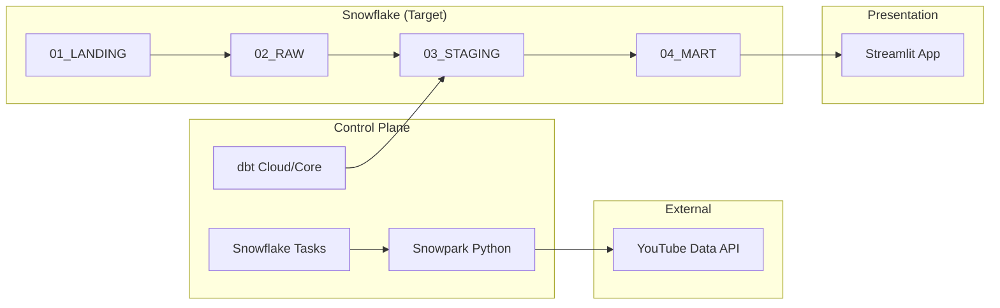

# 🚀 YouTube Metrics Pipeline: An Agentic Data Odyssey

   

An automated, end-to-end data platform built to extract, transform, and visualize YouTube channel performance. This project isn't just about data; it's a showcase of **Agentic AI Development**—a seamless synergy between human architectural vision and AI-driven implementation.

---

## 🌌 The Vision
Our mission is to turn raw, cumulative YouTube API metrics into deep, actionable insights for the **Cérnagyár** organization, starting with the **Fókusz Stúdió** creators. We leverage the full power of the Snowflake Native stack to build a platform that is scalable, cost-efficient, and secure.

## 🏗️ Technical Architecture



### The Stack
*   **Extraction**: Snowflake Native **Snowpark (Python)** Stored Procedures calling the YouTube API via External Network Access.
*   **Orchestration**: Snowflake **Tasks** for daily 1-2x refresh cycles.
*   **Transformation**: **dbt** (Data Build Tool) implementing Kimball Dimensional Modeling (Star Schema).
*   **Infrastructure**: Custom Python-driven **DDL Deployment Engine** (`deploy.py`) for SHA256-based idempotency.
*   **Governance**: Two-tier **RBAC** model with strict workload isolation and resource monitor capping (~5 EUR/month per warehouse).

---

## 🧠 Agentic Development Methodology
This repository is built using an **Agentic AI Lifecycle**. Every line of code and architectural pivot is a collaboration between the Human Pilot and a team of specialized AI Personas:

*   **Antigravity**: The Architectural Conscience & Project Mentor.
*   **Data Architect**: Strategic visionary for modeling and security.
*   **Data Engineer**: Precision builder of dbt models and SQL logic.
*   **DevOps Engineer**: Master of automation and the GitOps pipeline.
*   **Product Manager**: Bridge between business vision and engineering requirements.

---

## 📚 Knowledge Base & Learning
This project serves as a "Living Masterclass." Explore our domain-specific guides to learn the "Why" behind the architecture:

*   📖 **[Agentic Framework](docs/knowledge_base/01_agentic_development/conceptual_framework.md)**: PRDs, ADRs, and the Atomic Task Rule.
*   ❄️ **[Snowflake Patterns](docs/knowledge_base/02_snowflake/architecture_patterns.md)**: Medallion flow, RBAC, and Zero-Copy Cloning.
*   🧡 **[dbt Essentials](docs/knowledge_base/03_dbt/dbt_essentials.md)**: Materializations, SCD Type 2, and Lineage.
*   ⚙️ **[GitOps Principles](docs/knowledge_base/04_cicd/gitops_principles.md)**: SHA256 Idempotency and Environmental Isolation.

---

## 📂 Project Structure
```text
├── .agents/          # Personas, Rules, and ADRs
├── .deployment/      # Custom Snowflake Deployer (Python)
├── .setup/           # Baseline Snowflake Infrastructure (SQL)
├── dbt/              # dbt Project (Models, Macros, Seeds)
├── docs/             # Technical & Educational Documentation
└── snowflake/        # Medallion Layer DDL (Layered & Prefixed)
```

---
*Built with passion by **Matu94** & **Antigravity***
