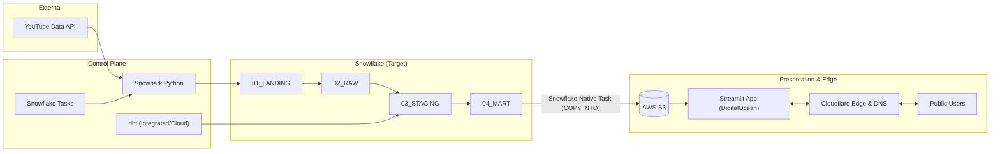

# YouTube Metrics Pipeline

       

> 🌐 **Live Public Dashboard:** [https://ytmetrics.matudata.com](https://ytmetrics.matudata.com)

An automated, end-to-end data platform built to extract, transform, and visualize YouTube channel performance. This project isn't just about data; it's a showcase of **Agentic AI Development**—a seamless synergy between human architectural vision and AI-driven implementation.

---

## The Vision
Our mission is to turn raw, cumulative YouTube API metrics into deep, actionable insights for various **Hungarian YouTube channels**. We leverage the full power of the Snowflake Native stack to build a platform that is scalable, cost-efficient, and secure.

## Technical Architecture

```mermaid
graph LR
    subgraph "External"
        API["YouTube Data API"]
    end

    subgraph "Snowflake (Target)"
        direction TB
        L["01_LANDING"] --> R["02_RAW"]
        R --> S["03_STAGING"]
        S --> M["04_MART"]
    end

    subgraph "Control Plane"
        API --> SP["Snowpark Python"]
        Tasks["Snowflake Tasks"] --> SP
        SP --> L
        dbt["dbt (Integrated/Cloud)"] --> S
    end

    subgraph "Presentation & Edge"
        S3[("AWS S3")]
        ST["Streamlit App (DigitalOcean)"]
        CF["Cloudflare Edge & DNS"]
        User["Public Users"]
    end

    M -->|"Snowflake Native Task (COPY INTO)"| S3
    S3 --> ST
    ST <--> CF
    CF <--> User
```

### The Stack
*   **Extraction**: Snowflake Native **Snowpark (Python)** Stored Procedures calling the YouTube API via External Network Access.
*   **Orchestration**: Snowflake **Tasks** for daily 1-2x refresh cycles.
*   **Transformation**: **dbt** (Data Build Tool) implementing Kimball Dimensional Modeling (Star Schema). We utilize the **Snowflake-integrated environment** (dbt Cloud) for centralized management and execution.
*   **Presentation**: Dual-mode **Streamlit** dashboard pulling natively exported Parquet data from **AWS S3** (`ADR-010` & `ADR-016`), hosted in a container on **DigitalOcean App Platform** (`ADR-014`), and shielded globally by **Cloudflare** with a custom domain at **[ytmetrics.matudata.com](https://ytmetrics.matudata.com)** (`ADR-015`).
*   **Infrastructure**: Custom Python-driven **DDL Deployment Engine** (`deploy.py`) for SHA256-based idempotency.
*   **Governance**: Two-tier **RBAC** model with strict workload isolation and resource monitor capping (5 Credits/month for CI/CD & Admin, 15 Credits/month for Load & Transform).

---

## Agentic Development Methodology
This repository is built using an **Agentic AI Lifecycle**. Every line of code and architectural pivot is a collaboration between the Human Pilot and a team of specialized AI Personas:

*   [**Antigravity**](.agents/personas/antigravity.md): The Architectural Conscience & Project Mentor. Ensures rule compliance, context hygiene, release manifest enforcement, and living documentation integrity.
*   [**Data Architect**](.agents/personas/data_architect.md): Strategic visionary for Kimball dimensional modeling, RBAC security, and Snowflake compute isolation.
*   [**Data Engineer**](.agents/personas/data_engineer.md): Precision builder of Snowpark Python ingestion procedures, dbt models, and idempotent SQL transformations.
*   [**DevOps Engineer**](.agents/personas/devops_engineer.md): Master of CI/CD automation, GitOps deployment pipelines, SHA256 checksum tracking, and environment promotions.
*   [**Product Manager**](.agents/personas/product_manager.md): Bridge between business vision and engineering requirements, governing PRD scope and channel metadata hierarchy.
*   [**BI Developer**](.agents/personas/bi_developer.md): Designer of dark-mode Streamlit dashboards, Altair visual analytics, and cached S3 Parquet consumption.
*   [**Senior Business Analyst & YouTube Data Analyst**](.agents/personas/data_analyst.md): Domain authority for presentation/mart reporting views (`rpt_*`), cross-view mathematical reconciliation (verifying that 7-day/30-day rolling sums accurately aggregate underlying daily deltas), $T-1$ upper-bound date compliance audits, and actionable creator/network performance insights.

---

## Knowledge Base & Learning
This project serves as a "Living Masterclass." Explore our domain-specific guides to learn the "Why" behind the architecture:

*   📖 **[Agentic Framework](file:///Users/matu/git/YT-SF-Agentic/docs/knowledge_base/01_agentic_development/conceptual_framework.md)**: PRDs, ADRs, and the Atomic Task Rule.
*   📈 **[Product Vision & Strategy](file:///Users/matu/git/YT-SF-Agentic/docs/knowledge_base/05_product_management/product_vision_and_strategy.md)**: Target channels and metadata hierarchy.
*   📺 **[YouTube API Integration](file:///Users/matu/git/YT-SF-Agentic/docs/knowledge_base/06_data_sources/youtube_api_v3.md)**: API requests, parts, and quota unit budget management.
*   ❄️ **[Snowflake Patterns](file:///Users/matu/git/YT-SF-Agentic/docs/knowledge_base/02_snowflake/architecture_patterns.md)**: Medallion flow, RBAC, and Zero-Copy Cloning.
*   🧡 **[dbt Essentials](file:///Users/matu/git/YT-SF-Agentic/docs/knowledge_base/03_dbt/dbt_essentials.md)**: Materializations, SCD Type 2, and Lineage.
*   ⚙️ **[GitOps Principles](file:///Users/matu/git/YT-SF-Agentic/docs/knowledge_base/04_cicd/gitops_principles.md)**: SHA256 Idempotency and Environmental Isolation.
*   🤖 **[AI Quota Strategy](file:///Users/matu/git/YT-SF-Agentic/docs/knowledge_base/01_agentic_development/ai_quotas_and_efficiency.md)**: Context caching, token budget optimization, and LLM orchestration.
*   📊 **[DigitalOcean & Cloudflare Architecture](file:///Users/matu/git/YT-SF-Agentic/docs/knowledge_base/07_presentation_layer/streamlit_hosting.md)**: Containerized Streamlit deployment, S3 data decoupling, and Cloudflare edge proxy protection.
*   ☁️ **[AWS S3 & IAM](file:///Users/matu/git/YT-SF-Agentic/docs/knowledge_base/08_cloud_infrastructure/aws_s3_iam.md)**: Serverless static data hosting, IAM security, and least-privilege policies.

---

## Project Structure
*   📁 **[.agents/](file:///Users/matu/git/YT-SF-Agentic/.agents)**: Personas, rules, and ADRs.
*   📁 **[.deployment/](file:///Users/matu/git/YT-SF-Agentic/.deployment)**: Custom Snowflake Deployer CLI ([deploy.py](file:///Users/matu/git/YT-SF-Agentic/.deployment/deploy.py)).
*   📁 **[.setup/](file:///Users/matu/git/YT-SF-Agentic/.setup)**: Snowflake role, database, and user bootstrap scripts.
*   📁 **[dbt/](file:///Users/matu/git/YT-SF-Agentic/dbt)**: Data transformation models, schemas, and seeds.
*   📁 **[docs/](file:///Users/matu/git/YT-SF-Agentic/docs)**: Technical guides, diagrams, and documentation.
*   📁 **[snowflake/](file:///Users/matu/git/YT-SF-Agentic/snowflake)**: Layered Medallion DDL files (e.g., `01_landing`, `02_raw`).
*   📁 **[streamlit/](file:///Users/matu/git/YT-SF-Agentic/streamlit)**: Application code for the presentation layer.
*   📄 **[CHANGELOG.md](file:///Users/matu/git/YT-SF-Agentic/CHANGELOG.md)**: Full release history and semantic version tracking.

---
*Built with passion by **Matu94** & **Antigravity***
