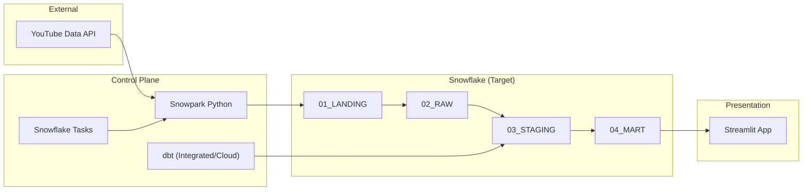

# 🚀 YouTube Metrics Pipeline

   

An automated, end-to-end data platform built to extract, transform, and visualize YouTube channel performance. This project isn't just about data; it's a showcase of **Agentic AI Development**—a seamless synergy between human architectural vision and AI-driven implementation.

---

## 🌌 The Vision
Our mission is to turn raw, cumulative YouTube API metrics into deep, actionable insights for various **Hungarian YouTube channels**. We leverage the full power of the Snowflake Native stack to build a platform that is scalable, cost-efficient, and secure.

## 🏗️ Technical Architecture

```mermaid
graph LR
    subgraph "External"
        API[YouTube Data API]
    end

    subgraph "Snowflake (Target)"
        direction TB
        L[01_LANDING] --> R[02_RAW]
        R --> S[03_STAGING]
        S --> M[04_MART]
    end

    subgraph "Control Plane"
        API --> SP[Snowpark Python]
        Tasks[Snowflake Tasks] --> SP
        SP --> L
        dbt["dbt (Integrated/Cloud)"] --> S
    end

    subgraph "Presentation"
        ST[Streamlit App]
    end

    M --> ST
```

### The Stack
*   **Extraction**: Snowflake Native **Snowpark (Python)** Stored Procedures calling the YouTube API via External Network Access.
*   **Orchestration**: Snowflake **Tasks** for daily 1-2x refresh cycles.
*   **Transformation**: **dbt** (Data Build Tool) implementing Kimball Dimensional Modeling (Star Schema). We utilize the **Snowflake-integrated environment** (dbt Cloud) for centralized management and execution.
*   **Infrastructure**: Custom Python-driven **DDL Deployment Engine** (`deploy.py`) for SHA256-based idempotency.
*   **Governance**: Two-tier **RBAC** model with strict workload isolation and resource monitor capping (5 Credits/month for CI/CD & Admin, 15 Credits/month for Load & Transform).

---

## 🧠 Agentic Development Methodology
This repository is built using an **Agentic AI Lifecycle**. Every line of code and architectural pivot is a collaboration between the Human Pilot and a team of specialized AI Personas:

*   **Antigravity**: The Architectural Conscience & Project Mentor.
*   **Data Architect**: Strategic visionary for modeling and security.
*   **Data Engineer**: Precision builder of dbt models and SQL logic.
*   **DevOps Engineer**: Master of automation and the GitOps pipeline.
*   **Product Manager**: Bridge between business vision and engineering requirements.
*   **BI Developer**: Designer of interactive dark-mode dashboards for content performance exploration.
*   **Senior Business Analyst & Data Analyst**: Domain expert for cross-view metric reconciliation, data integrity auditing, and business insight generation.

---

## 📚 Knowledge Base & Learning
This project serves as a "Living Masterclass." Explore our domain-specific guides to learn the "Why" behind the architecture:

*   📖 **[Agentic Framework](file:///Users/matu/git/YT-SF-Agentic/docs/knowledge_base/01_agentic_development/conceptual_framework.md)**: PRDs, ADRs, and the Atomic Task Rule.
*   📈 **[Product Vision & Strategy](file:///Users/matu/git/YT-SF-Agentic/docs/knowledge_base/05_product_management/product_vision_and_strategy.md)**: Target channels and metadata hierarchy.
*   📺 **[YouTube API Integration](file:///Users/matu/git/YT-SF-Agentic/docs/knowledge_base/06_data_sources/youtube_api_v3.md)**: API requests, parts, and quota unit budget management.
*   ❄️ **[Snowflake Patterns](file:///Users/matu/git/YT-SF-Agentic/docs/knowledge_base/02_snowflake/architecture_patterns.md)**: Medallion flow, RBAC, and Zero-Copy Cloning.
*   🧡 **[dbt Essentials](file:///Users/matu/git/YT-SF-Agentic/docs/knowledge_base/03_dbt/dbt_essentials.md)**: Materializations, SCD Type 2, and Lineage.
*   ⚙️ **[GitOps Principles](file:///Users/matu/git/YT-SF-Agentic/docs/knowledge_base/04_cicd/gitops_principles.md)**: SHA256 Idempotency and Environmental Isolation.
*   🤖 **[AI Quota Strategy](file:///Users/matu/git/YT-SF-Agentic/docs/knowledge_base/01_agentic_development/ai_quotas_and_efficiency.md)**: Context caching, token budget optimization, and LLM orchestration.

---

## 📂 Project Structure
*   📁 **[.agents/](file:///Users/matu/git/YT-SF-Agentic/.agents)**: Personas, rules, and ADRs.
*   📁 **[.deployment/](file:///Users/matu/git/YT-SF-Agentic/.deployment)**: Custom Snowflake Deployer CLI ([deploy.py](file:///Users/matu/git/YT-SF-Agentic/.deployment/deploy.py)).
*   📁 **[.setup/](file:///Users/matu/git/YT-SF-Agentic/.setup)**: Snowflake role, database, and user bootstrap scripts.
*   📁 **[dbt/](file:///Users/matu/git/YT-SF-Agentic/dbt)**: Data transformation models, schemas, and seeds.
*   📁 **[docs/](file:///Users/matu/git/YT-SF-Agentic/docs)**: Technical guides, diagrams, and documentation.
*   📁 **[snowflake/](file:///Users/matu/git/YT-SF-Agentic/snowflake)**: Layered Medallion DDL files (e.g., `01_landing`, `02_raw`).

---
*Built with passion by **Matu94** & **Antigravity***
