# High-Level Architecture Flowchart

This diagram illustrates the end-to-end data flow, orchestration, and presentation layers for the YouTube Metrics Pipeline.

```mermaid
graph LR
    %% Styling
    classDef github fill:#24292e,stroke:#fff,stroke-width:2px,color:#fff;
    classDef snowflake fill:#29b5e8,stroke:#fff,stroke-width:2px,color:#fff;
    classDef dbt fill:#ff694b,stroke:#fff,stroke-width:2px,color:#fff;
    classDef aws fill:#ff9900,stroke:#fff,stroke-width:2px,color:#fff;
    classDef digitalocean fill:#0080ff,stroke:#fff,stroke-width:2px,color:#fff;
    classDef streamlit fill:#ff4b4b,stroke:#fff,stroke-width:2px,color:#fff;
    classDef cloudflare fill:#f38020,stroke:#fff,stroke-width:2px,color:#fff;

    %% External Sources
    YT["▶️ YouTube API<br/>(Source Data)"]

    %% Orchestration
    GH["🐙 GitHub Actions<br/>(CI/CD & Orchestration)"]:::github

    %% Snowflake Environment
    subgraph Snowflake
        SP["❄️ Snowpark (Python)<br/>(API Extraction)"]:::snowflake
        DB[("🗄️ Snowflake Storage<br/>(Raw ➔ Staging ➔ Mart)")]:::snowflake
        DBT["🧊 dbt<br/>(Data Transformation)"]:::dbt
    end

    %% Storage & Serving
    subgraph Cloud Infrastructure
        S3[("🪣 AWS S3<br/>(Partitioned Parquet)")]:::aws
        DO["💧 DigitalOcean App Platform<br/>(2GB RAM Container)"]:::digitalocean
        ST["👑 Streamlit & DuckDB<br/>(Web Application)"]:::streamlit
        CF["🛡️ Cloudflare<br/>(DNS, DDoS & Edge CDN)"]:::cloudflare
    end

    %% End User
    User(("🧑‍💻 End User<br/>(ytmetrics.matudata.com)"))

    %% Data Flow & Triggers
    GH -.->|"Schedules & Deploys"| SP
    GH -.->|"Runs Models"| DBT
    GH -.->|"Triggers Python Export"| S3

    YT ==>|"JSON Metrics"| SP
    SP ==>|"Inserts Raw Data"| DB
    DBT ==>|"Transforms to Star Schema"| DB
    DB ==>|"Exports OBT Views"| S3
    
    S3 ==>|"HTTP Range Requests<br/>(Predicate Pushdown)"| ST
    ST --- DO
    DO ==>|"HTTPS (Origin)"| CF
    CF ==>|"Secure Edge Delivery"| User
```

### Flow Breakdown:
1. **Extraction**: **GitHub Actions** triggers **Snowpark** stored procedures. Snowpark natively queries the **YouTube API** via External Network Access and lands the JSON responses in the **Snowflake** Raw layer.
2. **Transformation**: **dbt** processes the raw JSON, converting it into a structured Kimball dimensional model (Staging ➔ Mart).
3. **Export**: A Python script in **GitHub Actions** queries the final One Big Table (OBT) views in Snowflake and exports them to **AWS S3** as highly optimized, partitioned Parquet files.
4. **Presentation & Edge**: **DigitalOcean App Platform** hosts the containerized **Streamlit** web application. When a user requests data, the embedded **DuckDB** engine reads only the required partitions directly from **AWS S3**. Traffic is proxied through **Cloudflare** for DNS management, DDoS mitigation, and edge caching at **https://ytmetrics.matudata.com**.
