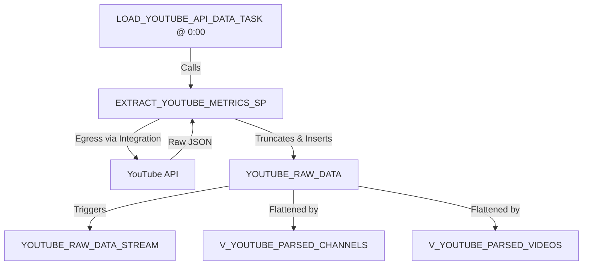

# LANDING Layer (Layer 1)

The `LANDING` schema is the entry point for raw ingestion. It acts as a transient workspace where JSON payloads extracted directly from the YouTube API are temporarily stored before being loaded downstream.

To prevent infinite storage accumulation and keep Snowflake operations lightweight, the ingestion procedure truncates the landing tables before starting a new run.

---

## 1. Existing Objects

### 1.1 Tables
*   **`LANDING.YOUTUBE_RAW_DATA` (Transient Table)**
    *   **Purpose**: Holds raw variant JSON responses from the YouTube API.
    *   **Structure**:
        *   `RAW_JSON` (`VARIANT`): Contains the raw JSON payload.
        *   `EXTRACTED_AT` (`TIMESTAMP_NTZ`): Captures the wall-clock timestamp of the extraction (defaulting to Europe/Budapest local time).

### 1.2 Streams
*   **`LANDING.YOUTUBE_RAW_DATA_STREAM` (Append-Only Stream)**
    *   **Purpose**: Automatically captures insert operations on `LANDING.YOUTUBE_RAW_DATA`.
    *   **Usage**: Used by downstream tasks to incrementally consume new raw JSON payloads and write them to the `RAW` schema table, resetting the stream offset upon commit.

### 1.3 Views
*   **`LANDING.V_YOUTUBE_PARSED_CHANNELS`**
    *   **Purpose**: Flattens and parses the nested channel stats JSON from `YOUTUBE_RAW_DATA`.
    *   **Exposed Metrics**: Channel Title, Custom URL, Subscriber Count, View Count, Uploads Playlist ID, and Country.
*   **`LANDING.V_YOUTUBE_PARSED_VIDEOS`**
    *   **Purpose**: Flattens and parses the nested video details JSON from `YOUTUBE_RAW_DATA`.
    *   **Exposed Metrics**: Video Title, Published Date, Duration (ISO 8601), Live Broadcast Content, View Count, Like Count, and Comment Count.

### 1.4 Stored Procedures
*   **`LANDING.EXTRACT_YOUTUBE_METRICS_SP` (Snowpark Python)**
    *   **Purpose**: Programmatically connects to the YouTube API using External Network Access, queries channel and video metrics, parses the raw payload structure, and inserts it into `LANDING.YOUTUBE_RAW_DATA`.
    *   **Flow**:
        1. Sets session/account timezone context to `Europe/Budapest` (guaranteeing `CURRENT_DATE()` alignment across morning loads per ADR-005).
        2. Truncates `LANDING.YOUTUBE_RAW_DATA`.
        3. Fetches details for the targeted channels (configured inside the procedure).
        4. Extracts the "uploads" playlist for each channel and paginates through all video IDs.
        5. Batches video queries (max 50 per call) to retrieve stats (views, likes, comments, duration).
        6. Inserts raw JSON payloads into the table.

### 1.5 Tasks
*   **`LANDING.LOAD_YOUTUBE_API_DATA_TASK`**
    *   **Orchestration**: Runs every day at midnight Budapest time (`0 0 * * * Europe/Budapest`).
    *   **Action**: Calls `LANDING.EXTRACT_YOUTUBE_METRICS_SP()` to run the ingestion pipeline.
    *   **Warehouse**: Executed on `YT_SF_LOAD_WH`.

---

## 2. Ingestion Flow & How It Works

1. The orchestrator task wakes up at midnight Budapest time.
2. The Snowpark Stored Procedure runs, establishing a session timezone in Budapest (`Europe/Budapest`).
3. Landing tables are truncated.
4. Outbound HTTPS connections fetch the stats using secure secrets.
5. Payloads are written to `YOUTUBE_RAW_DATA`.
6. The `YOUTUBE_RAW_DATA_STREAM` captures the insert events and holds them ready for the raw historical load process.
