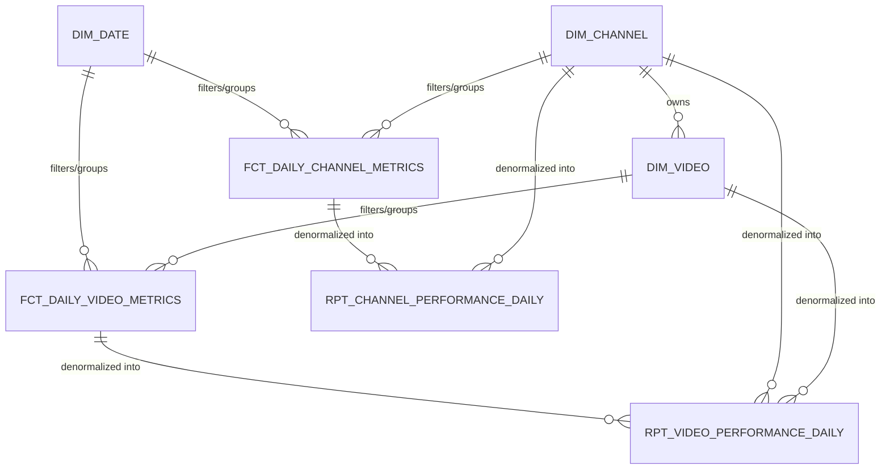

# MART Layer (Layer 4)

The `MART` schema is the presentation layer serving downstream data consumers (such as Streamlit applications or BI tools). It is fully managed by **dbt** and structured using Kimball dimensional modeling (Star Schema) consisting of facts and dimensions.

---

## 1. Existing Objects

### 1.1 Dimension Tables
*   **`MART.DIM_CHANNEL` (SCD Type 2 Table)**
    *   **Source**: `STAGING.DIM_CHANNEL_SNAPSHOT`.
    *   **Grain**: One row per channel per active period.
    *   **Purpose**: Tracks channel attributes and organizational structures. Contains `valid_from`, `valid_to`, and `is_active` fields to map historical records accurately.
*   **`MART.DIM_VIDEO` (Standard Dimension Table)**
    *   **Source**: `STAGING.STG_YOUTUBE_VIDEO_STATS`.
    *   **Grain**: One row per unique video.
    *   **Purpose**: Tracks static properties of videos such as publishing date, title, duration (in seconds), and content format classification (`video_type` categorized as `'video'`, `'short'`, or `'live'`).
*   **`MART.DIM_DATE` (Static Calendar Dimension)**
    *   **Purpose**: Provides standard calendar context (year, month, day, day of week) to support time-series analysis and filtering.

### 1.2 Fact Tables
*   **`MART.FCT_DAILY_CHANNEL_METRICS` (Fact Table)**
    *   **Source**: `STAGING.STG_YOUTUBE_CHANNEL_STATS`.
    *   **Grain**: One row per channel per day.
    *   **Metrics**: Total subscribers, daily subscriber growth delta, total view count, daily view count delta, and total video count.
*   **`MART.FCT_DAILY_VIDEO_METRICS` (Fact Table)**
    *   **Source**: `STAGING.STG_YOUTUBE_VIDEO_STATS`.
    *   **Grain**: One row per video per day.
    *   **Metrics**: Total views, daily view growth, total likes, daily like growth, total comments, and daily comment growth.

### 1.3 Presentation Views (OBT)
*   **`MART.RPT_VIDEO_PERFORMANCE_DAILY` (View)**
    *   **Source**: `MART.FCT_DAILY_VIDEO_METRICS`, `MART.DIM_VIDEO`, `MART.DIM_CHANNEL`.
    *   **Grain**: One row per video per day.
    *   **Purpose**: Fully denormalized view combining video facts with dimension details to eliminate query-time joins in downstream Streamlit apps.
*   **`MART.RPT_CHANNEL_PERFORMANCE_DAILY` (View)**
    *   **Source**: `MART.FCT_DAILY_CHANNEL_METRICS`, `MART.DIM_CHANNEL`.
    *   **Grain**: One row per channel per day.
    *   **Purpose**: Fully denormalized view combining channel facts (including daily views) with channel metadata.

### 1.4 Streamlit Components
*   **`MART.STREAMLIT_STAGE` (Stage)**
    *   **Purpose**: Directory stage containing the Python source files, assets, and dependency definition (`environment.yml`) for the Native Streamlit dashboard.
*   **`MART.YOUTUBE_METRICS_DASHBOARD` (Streamlit App)**
    *   **Purpose**: The Snowflake Native Streamlit application object that serves the multi-page dashboard in the Snowsight UI. It uses the `YT_SF_TRANSFORM_WH` warehouse for execution.
    *   **Page Structure**:
        *   **`Home.py` (Welcome Landing Page)**: Displays welcome message, pipeline health indicator with latest available date, top-level platform KPI metrics (Total Tracked Channels, Total Subscribers, Total Views), and an expandable Channel Directory grouped by Organization and Studio.
        *   **`pages/1_Daily_Views.py` (Daily Views Dashboard)**: Provides channel-level view performance analytics over time, featuring hierarchical sidebar dropdown filters (Organization -> Studio -> Channel) and Altair charts.
        *   **`pages/2_Video_Statistics.py` (Video Statistics Dashboard)**: Provides video-level analytics powered by `MART.RPT_VIDEO_PERFORMANCE_DAILY`, featuring:
            *   *Metric Grain Selector*: Daily/Weekly metric toggle placeholder.
            *   *Latest Date Filtering*: Automatically filters to the latest `METRIC_DATE` to present single-day video performance.
            *   *Cascading Multi-Select Filters*: Dependent multi-select dropdowns for Organizations, Teams, and Channels.
            *   *Content Format Filter*: Multi-select filtering for `VIDEO_TYPE` (`video`, `short`, `live`).
            *   *Aggregated Chart*: Altair bar chart displaying total views per channel, with tooltips showing channel name, period views, and unique video count (`VIDEO_COUNT`).
            *   *Top Videos Table*: Interactive data table showing top 100 performing videos with direct YouTube watch links (`LinkColumn`).

---

## 2. Ingestion Flow & Star Schema Design

1. **dbt runs** compile the dimensions first (to ensure entity lookups are populated), followed by the facts.
2. Fact tables join raw metrics against `dim_channel` and `dim_video` to resolve surrogate keys and historical parent groups (e.g. Creator Studios, niches).
3. Presentation views denormalize these dimensions and facts into One Big Table (OBT) formats for low-latency querying.
4. The resulting models provide a fast, structured layer optimized for Streamlit dashboards.
