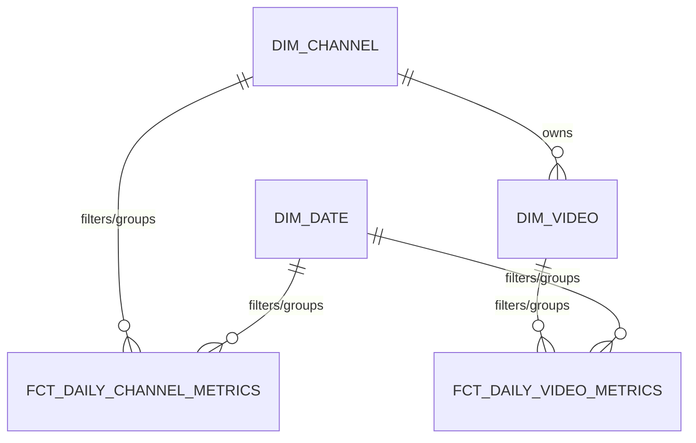

# MART Layer (Layer 4)

The `MART` schema is the presentation layer serving downstream data consumers (such as Streamlit applications or BI tools). It is fully managed by **dbt** and structured using Kimball dimensional modeling (Star Schema) consisting of facts and dimensions.

---

## 1. Existing Objects

### 1.1 Dimension Tables
*   **`MART.DIM_CHANNEL` (SCD Type 2 Table)**
    *   **Source**: `STAGING.DIM_CHANNEL_SNAPSHOT`.
    *   **Grain**: One row per channel per active period.
    *   **Purpose**: Tracks channel attributes and organizational structures. Contains `valid_from`, `valid_to`, and `is_active` fields to map historical records accurately.
*   **`MART.DIM_VIDEO` (Standard Dimension Table)**
    *   **Source**: `STAGING.STG_YOUTUBE_VIDEO_STATS`.
    *   **Grain**: One row per unique video.
    *   **Purpose**: Tracks static properties of videos such as publishing date, title, duration (in seconds), and content format classification (`video_type` categorized as `'video'`, `'short'`, or `'live'`).
*   **`MART.DIM_DATE` (Static Calendar Dimension)**
    *   **Purpose**: Provides standard calendar context (year, month, day, day of week) to support time-series analysis and filtering.

### 1.2 Fact Tables
*   **`MART.FCT_DAILY_CHANNEL_METRICS` (Fact Table)**
    *   **Source**: `STAGING.STG_YOUTUBE_CHANNEL_STATS`.
    *   **Grain**: One row per channel per day.
    *   **Metrics**: Total subscribers, daily subscriber growth delta, total view count, and total video count.
*   **`MART.FCT_DAILY_VIDEO_METRICS` (Fact Table)**
    *   **Source**: `STAGING.STG_YOUTUBE_VIDEO_STATS`.
    *   **Grain**: One row per video per day.
    *   **Metrics**: Total views, daily view growth, total likes, daily like growth, total comments, and daily comment growth.

---

## 2. Ingestion Flow & Star Schema Design

1. **dbt runs** compile the dimensions first (to ensure entity lookups are populated), followed by the facts.
2. Fact tables join raw metrics against `dim_channel` and `dim_video` to resolve surrogate keys and historical parent groups (e.g. Creator Studios, niches).
3. The resulting Star Schema provides a fast, structured layer optimized for Streamlit dashboards.
