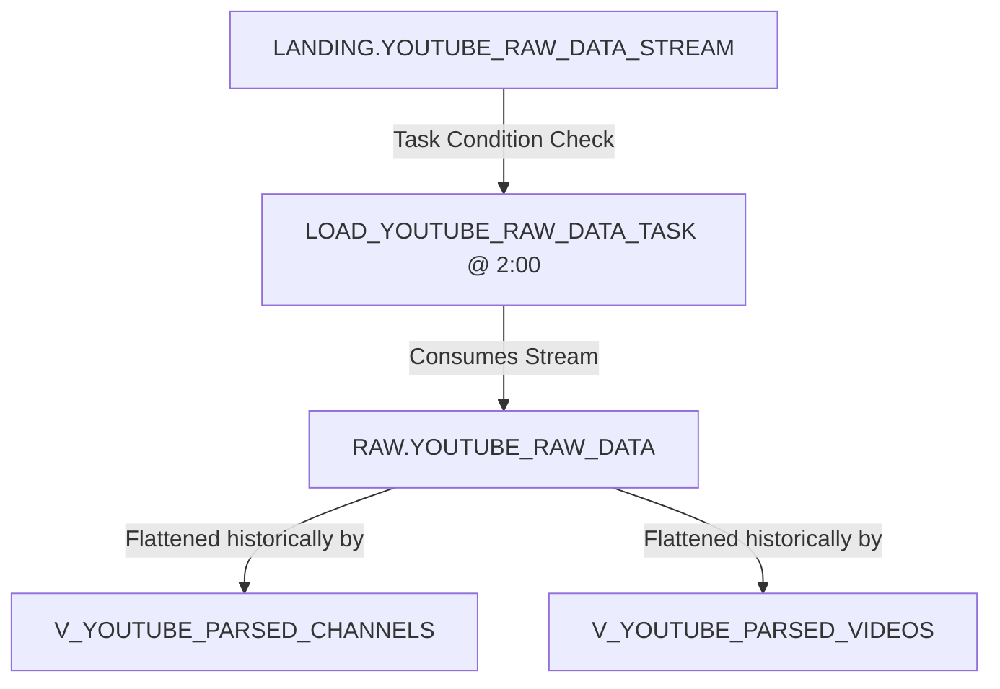

# RAW Layer (Layer 2)

The `RAW` schema is the persistent historical storage layer. Unlike the transient `LANDING` layer, `RAW` retains all raw API responses ingested since the start of the project. This permits historical recalculations, structural audit checks, and schema upgrades without needing to re-query the YouTube API.

---

## 1. Existing Objects

### 1.1 Tables
*   **`RAW.YOUTUBE_RAW_DATA` (Standard Table)**
    *   **Purpose**: The central repository for all raw JSON responses.
    *   **Clustering**: Clustered by `RAW_JSON:kind::string` and the date of extraction `EXTRACTED_AT::DATE` to optimize scan performance when parsing channels vs. videos historically.
    *   **Structure**:
        *   `RAW_JSON` (`VARIANT`): Historical raw variant JSON payload.
        *   `EXTRACTED_AT` (`TIMESTAMP_NTZ`): Timestamp of ingestion in Budapest local time.

### 1.2 Views
*   **`RAW.V_YOUTUBE_PARSED_CHANNELS`**
    *   **Purpose**: Flattens and parses the nested channel stats JSON from `RAW.YOUTUBE_RAW_DATA` to expose full historical records.
*   **`RAW.V_YOUTUBE_PARSED_VIDEOS`**
    *   **Purpose**: Flattens and parses the nested video details JSON from `RAW.YOUTUBE_RAW_DATA` to expose full historical records.

### 1.3 Tasks
*   **`RAW.LOAD_YOUTUBE_RAW_DATA_TASK`**
    *   **Orchestration**: Runs every day at 2:00 AM Budapest time (`0 2 * * * Europe/Budapest`).
    *   **Condition**: Only executes if `SYSTEM$STREAM_HAS_DATA('LANDING.YOUTUBE_RAW_DATA_STREAM')` evaluates to `TRUE`.
    *   **Action**: Performs an incremental insert-only load:
        ```sql
        INSERT INTO RAW.YOUTUBE_RAW_DATA (RAW_JSON, EXTRACTED_AT)
        SELECT RAW_JSON, EXTRACTED_AT 
        FROM LANDING.YOUTUBE_RAW_DATA_STREAM 
        WHERE METADATA$ACTION = 'INSERT';
        ```
    *   **Warehouse**: Executed on `YT_SF_TRANSFORM_WH`.

---

## 2. Ingestion Flow & How It Works



1. The task wakes up at 2:00 AM Budapest local time (2 hours after the landing load finishes).
2. It evaluates whether the landing stream contains unconsumed change logs.
3. If new data exists, it inserts the stream contents directly into `RAW.YOUTUBE_RAW_DATA`. Since the stream includes the `EXTRACTED_AT` timestamp computed at landing, the exact ingestion time is preserved.
4. Upon execution completion, the stream offset commits, clearing the stream for the next day.
