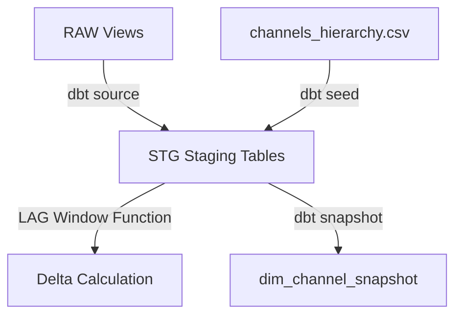

# STAGING Layer (Layer 3)

The `STAGING` schema is the processing layer where raw data is cleaned, validated, cast to typed columns, and calculated. It is fully managed by **dbt (Data Build Tool)**.

Staging models are built on top of the historical views in the `RAW` schema. The main complexity of this layer lies in delta calculations: because the YouTube API returns cumulative lifetime metrics (like total views or subscribers), the staging models compute the daily increments (deltas) using window functions.

---

## 1. Existing Objects

### 1.1 Tables (Materialized as Incremental)
*   **`STAGING.STG_YOUTUBE_CHANNEL_STATS` (Incremental Table)**
    *   **Source**: `RAW.V_YOUTUBE_PARSED_CHANNELS` and the `STAGING.CHANNELS_HIERARCHY` seed.
    *   **Grain**: One row per channel per day.
    *   **Calculations**: Computes `metric_date` bounded by the channel creation/published date. Deduplicates multiple runs within a single day (by taking the latest `extracted_at` timestamp per `metric_date`) and calculates `daily_subscriber_growth` by subtracting yesterday's cumulative subscribers from today's subscribers:
        ```sql
        total_subscribers - LAG(total_subscribers, 1) OVER (PARTITION BY channel_id ORDER BY metric_date ASC)
        ```
    *   **Strategy**: `merge` on `['channel_id', 'metric_date']`. Uses schema evolution option `on_schema_change='append_new_columns'`.
*   **`STAGING.STG_YOUTUBE_VIDEO_STATS` (Incremental Table)**
    *   **Source**: `RAW.V_YOUTUBE_PARSED_VIDEOS`.
    *   **Grain**: One row per video per day.
    *   **Calculations**: Calculates `metric_date` using a lower-bound `GREATEST(DATEADD(day, -1, CAST(extracted_at AS DATE)), CAST(CONVERT_TIMEZONE('UTC', 'Europe/Budapest', published_at) AS DATE))` to prevent assigning performance prior to the published date during intra-day runs. Deduplicates multiple extractions within a single day and computes `daily_views`, `daily_likes`, and `daily_comments` using `LAG()` window functions over the video's history.
    *   **Strategy**: `merge` on `['video_id', 'metric_date']`.

### 1.2 Snapshots (SCD Type 2)
*   **`STAGING.DIM_CHANNEL_SNAPSHOT`**
    *   **Source**: `STAGING.STG_YOUTUBE_CHANNEL_STATS` joined with the hierarchy seed.
    *   **Purpose**: Tracks historical metadata updates for channels (such as name renames or changes in custom URL or country).
    *   **Mechanism**: Automatically manages `dbt_valid_from`, `dbt_valid_to`, and `dbt_scd_id`.

### 1.3 Seeds
*   **`STAGING.CHANNELS_HIERARCHY`**
    *   **Source**: [channels_hierarchy.csv](file:///Users/matu/git/YT-SF-Agentic/dbt/seeds/channels_hierarchy.csv).
    *   **Purpose**: Maps channel IDs to their creator studio/creator team, content type niche, and parent organization (e.g. Content Network > Creator Studio).

---

## 2. Ingestion Flow & How It Works



1. During dbt execution, staging tables are processed incrementally.
2. The staging models fetch raw records that are newer than the last compiled date. To ensure accurate delta (`LAG`) calculations, the models also load the previous day's metrics.
3. The delta calculation computes the difference between cumulative totals to reveal daily performance metrics.
4. The snapshot logic tracks historical changes to channel details, recording Type 2 history.
