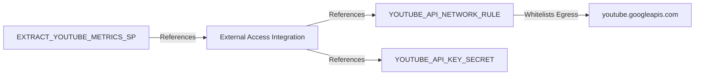

# TECH Layer (Infrastructure)

The `TECH` schema houses technical metadata, state tables, and infrastructure integrations required to securely connect Snowflake to external services (like the YouTube Data API and GitHub).

---

## 1. Existing Objects

### 1.1 Tables (Deployment Tracking)
*   **`TECH.DEPLOYMENT_HISTORY`**
    *   **Purpose**: Logs execution states of the repository's deployment scripts.
    *   **Fields**: `DEPLOYMENT_ID` (UUID), `FOLDER_NAME`, `COMMIT_SHA`, `DEPLOYMENT_STATUS` (`PENDING`, `SUCCESS`, `FAILED`), `START_TIME`, `END_TIME`, and `BRANCH_NAME`.
*   **`TECH.DEPLOYMENT_FILE_HISTORY`**
    *   **Purpose**: Logs the status of individual DDL files executed during a deployment.
    *   **Fields**: `FILE_PATH`, `FILE_HASH` (SHA-256 hash of the content to skip unchanged files), `STATUS` (`SUCCESS`, `FAILED`), `ERROR_MESSAGE`, and `DEPLOYED_AT`.

### 1.2 External Network Access Objects
*   **`TECH.YOUTUBE_API_NETWORK_RULE` (Network Rule)**
    *   **Type**: `EGRESS`
    *   **Value**: Whitelists outbound HTTPS requests to `youtube.googleapis.com`.
*   **`TECH.YOUTUBE_API_KEY_SECRET` (Secret)**
    *   **Type**: `GENERIC_STRING`
    *   **Purpose**: Securely stores the YouTube Data API v3 key.
*   **`YT_SF_{ENV}_YOUTUBE_API_INTEGRATION` (External Access Integration)**
    *   **Scope**: Account-Level Object.
    *   **Purpose**: Binds the network rule and API secret together, exposing them to the Snowpark stored procedure in the `LANDING` schema.

### 1.3 Git Integration Objects
*   **`TECH.GITHUB_TOKEN_SECRET` (Secret)**
    *   **Purpose**: Stores a GitHub Personal Access Token (PAT) securely.
*   **`YT_SF_{ENV}_GITHUB_API_INTEGRATION` (API Integration)**
    *   **Scope**: Account-Level Object.
    *   **Purpose**: Bridges communication between Snowflake and GitHub.
*   **`TECH.YT_SF_AGENTIC_REPO` (Git Repository)**
    *   **Purpose**: Integrates the repository files directly into Snowflake as a stage, enabling native code version control, Snowflake Workspaces UI support, and Streamlit execution from a branch.

---

## 2. Security & Execution Flow

1. During procedure creation, the external access integration is bound via the `EXTERNAL_ACCESS_INTEGRATIONS` declaration.
2. The procedure calls `_snowflake.get_generic_secret_string('youtube_api_key')` to read the key dynamically in memory.
3. The Snowpark sandbox executes the Python code, connecting to YouTube through the whitelisted rule.
