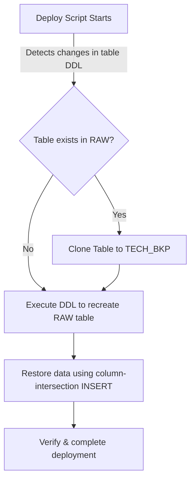

# TECH_BKP Layer (Backup & Sandboxing)

The `TECH_BKP` schema is a utility sandbox schema. It holds manual snapshots created by administrators and automated pre-migration clones created by the deployment pipeline to safeguard against data loss during database migrations.

---

## 1. Existing Objects

This schema is designed to be transient and dynamic. It does not contain permanently deployed structural objects. Instead, tables are cloned here dynamically:

*   **Cloned Tables (e.g. `TECH_BKP.RAW_YOUTUBE_RAW_DATA_YYYYMMDD_HHMMSS`)**
    *   **Source**: Created via `CREATE OR REPLACE TABLE TECH_BKP.RAW_YOUTUBE_RAW_DATA_... CLONE RAW.YOUTUBE_RAW_DATA`.
    *   **Purpose**: Preserves historical table data before a destructive DDL statement (like changing a column data type, clustering keys, or rewriting structures).
    *   **Lifespan**: Intended to be dropped manually after validation, or automatically managed by administration routines.

---

## 2. Pre-Migration Clone & Restore Flow

The deployment CLI script ([deploy.py](file:///Users/matu/git/YT-SF-Agentic/.deployment/deploy.py)) automatically utilizes this schema during table deployments:



### In-Depth Mechanism:
1. **Change Detection**: The script identifies that a table definition (e.g. `RAW.YOUTUBE_RAW_DATA`) has changed.
2. **Clone Creation**: If the table already exists, the script issues a fast metadata clone:
   ```sql
   CREATE OR REPLACE TABLE TECH_BKP.<schema>_<table_name>_<timestamp> CLONE <database>.<schema>.<table_name>;
   ```
3. ** डीडीएल Execution**: Recreates the destination table with the new definition.
4. **Data Restoration**: Restores data from the cloned backup by matching matching columns (intersection):
   ```sql
   INSERT INTO <database>.<schema>.<table_name> (<intersecting_columns>)
   SELECT <intersecting_columns> FROM TECH_BKP.<schema>_<table_name>_<timestamp>;
   ```
5. **Rollback Capability**: If the restore or DDL fails, the backup remains untouched in `TECH_BKP`, allowing administrators to restore the table using:
   ```sql
   CREATE OR REPLACE TABLE RAW.YOUTUBE_RAW_DATA CLONE TECH_BKP.RAW_YOUTUBE_RAW_DATA_<timestamp>;
   ```
